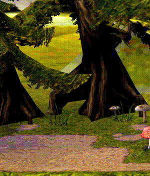
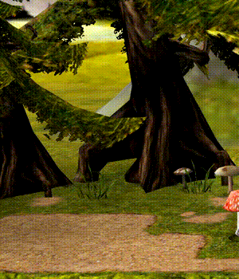

# Particles

### Command

`create_particlesource <ID> <POSITION> <DIRECTION> <COUNT> <TIME>`

### Available particles

- Particle no. 0

- Particle no. 1

- Particle no. 2

- Particle no. 3

- Particle no. 4

- Particle no. 6

- Particle no. 7

- Particle no. 8

- Particle no. 9

- Particle no. 10

- Particle no. 11

- Particle no. 12

- Particle no. 13

- Particle no. 14

- Particle no. 15

- Particle no. 16

- Particle no. 17

- Particle no. 18

- Particle no. 19

- Particle no. 20

- Particle no. 21

- Particle no. 22

- Particle no. 23

- Particle no. 24

- Particle no. 25

- Particle no. 26

- Particle no. 27

- Particle no. 28

- Particle no. 29

- Particle no. 30

- Particle no. 31

- Particle no. 32

- Particle no. 33

- Particle no. 34

- Particle no. 35

- Particle no. 36

- Particle no. 37

- Particle no. 38

- Particle no. 39

- Particle no. 40

- Particle no. 41

- Particle no. 42

